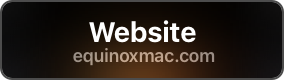
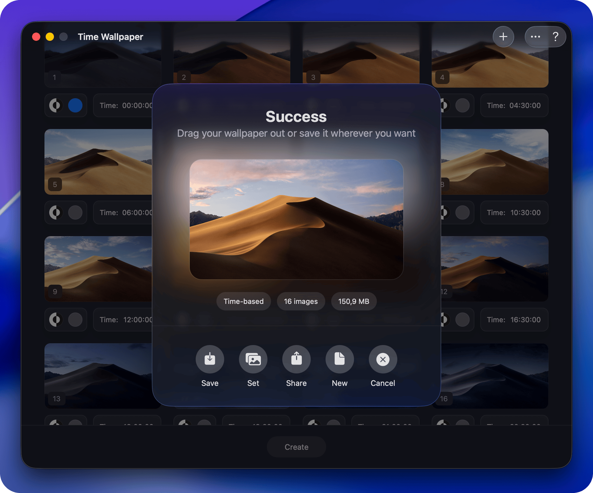
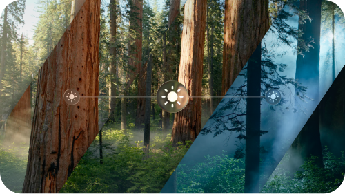
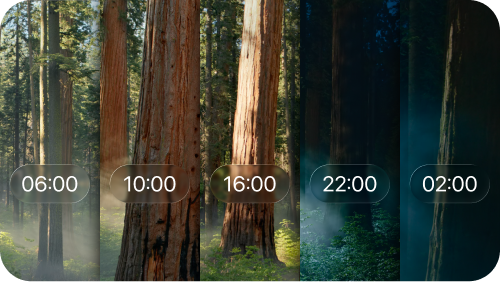
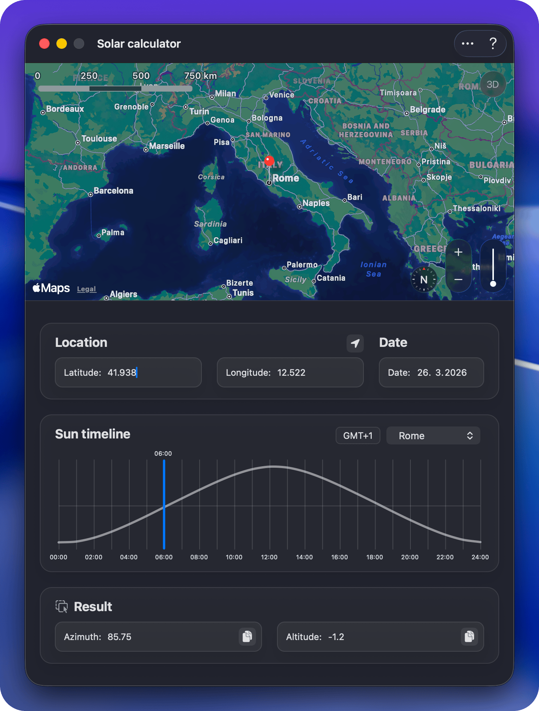
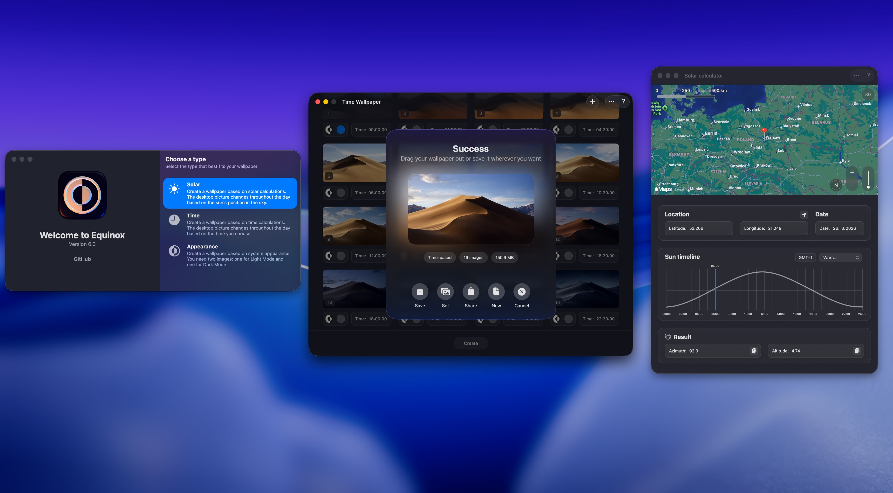

 

  
  
  

<h1></h1>

  
  <h1>Equinox</h1>
  
Create dynamic wallpapers for macOS

   

  
  
  
  
  
  
  

<h1></h1>

  
<i>If you enjoy using Equinox, you can support the project with a small donation. It helps me maintain the app, fix bugs, and keep updates coming. Thank you ❤️</i>

  

<h2></h2>

  

## Description

**[Equinox](https://equinoxmac.com)** is an app that lets you create **macOS-native dynamic wallpapers**. Starting with **macOS Mojave**, macOS supports wallpaper types like **Dynamic Desktop** and **Light & Dark Desktop**.

With **Equinox**, you can create these wallpapers in seconds: choose a type, drag and drop your images, and export your wallpaper.

## Features

There are **three** types of wallpapers you can create:

1. **[Solar](#solar-wallpaper)**
2. **[Time](#time-wallpaper)**
3. **[Appearance](#appearance-wallpaper)**

<h1></h1>

### Solar wallpaper

- This wallpaper type takes the **sun’s position** into account. Depending on the time of year, you’ll see the most appropriate image on your desktop.
- No need to calculate sun positions manually — with the **[Solar calculator](#solar-calculator)**, you only need to know **where and when** the photo was taken.

### Time wallpaper

- Time-based wallpapers change throughout the day according to the schedule you define.

### Appearance wallpaper

- This type is as simple as it sounds: the wallpaper changes based on the system appearance (Light/Dark Mode).
- You only need **two images**: one for Light Mode and one for Dark Mode.

<h1></h1>

### Solar calculator

  

The Solar calculator helps you determine the sun’s position in the sky.

1. Choose the **place**, **date**, and **time** on the **Sun timeline** for when the photo was taken.  
   If you don’t know the exact time, use the timeline to estimate the sun’s height and match it to your photos.
2. Drag and drop (or copy) the result onto your image.

## Screenshots

  

## FAQ

- **Q:** How do I set the wallpaper after saving?  
  **A:** Right-click your wallpaper, then choose **Services → Set Desktop Picture**.

 

- **Q:** I set up my wallpaper, but it doesn’t change over time.  
  **A:** This can be caused by a macOS issue. Before setting your wallpaper, make sure **Desktop & Screen Saver** is set to a **Dynamic** type:

  1. Open **Desktop & Screen Saver** in macOS Settings/Preferences.
  2. Choose any **Dynamic Desktop** wallpaper and set its type to **Dynamic**.
  3. Right-click your wallpaper, then choose **Services → Set Desktop Picture**.

 

- **Q:** How can I test whether my wallpaper works correctly?  
  **A:** Open **Settings/Preferences → Date & Time**, then change the time to see the wallpaper update.

## Requirements
- macOS 10.14 (Mojave) and later

## Libraries
- **[SolarNOAA](https://github.com/rlxone/SolarNOAA)**

## Thanks
Many thanks to the macOS community — and special thanks to [mczachurski](https://github.com/mczachurski) for the excellent articles.

## License
[MIT](LICENSE)

## Translation

Equinox is translated into:

- English
- French — by [W1W1-M](https://github.com/W1W1-M)
- Turkish — by [furkanipek](https://github.com/furkanipek)
- Chinese (Simplified) — by [Chuan Hu](https://github.com/GaiZhenbiao), [DevLiuSir](https://github.com/DevLiuSir)
- Chinese (Traditional) — by [5idereal](https://github.com/5idereal)
- Chinese (Traditional, Hong Kong) — by [changanmoon](https://github.com/changanmoon)
- German - by [sessbach](https://github.com/sessbach) & [niklaskroe](https://github.com/niklaskroe)
- Korean, by [R3pic](https://github.com/R3pic)
- Spanish (Latin America) by [rogeruiz](https://github.com/rogeruiz)
- Japanese — by [monta-gh](https://github.com/monta-gh)

To translate Equinox into another language:

- Fork the main branch.
- Create a branch for the new translation named: `translation-xx`, where `xx` is the language code (e.g., `en`, `fr`, `es`, `de`).
- Add the new language to the Xcode **Equinox** and **EquinoxAssets** projects.
- Add the new language to the `Localizable.strings` localization languages in **EquinoxAssets**.
- Update `Localizable.strings` with your translated strings.
- Update this section of the README with the new language.
- Open a pull request on GitHub.
