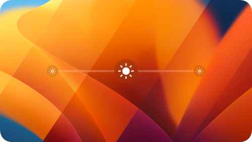
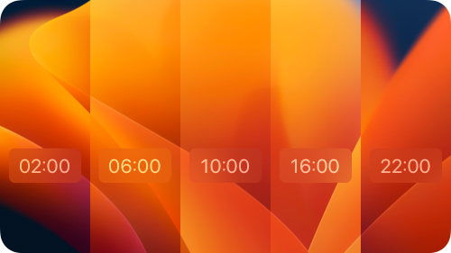
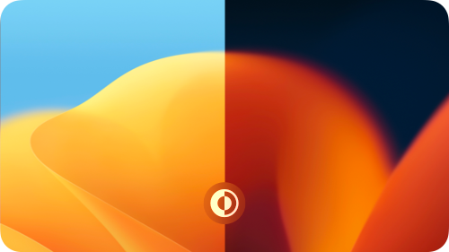

 

    

<h1></h1>

  
  <h1>Equinox</h1>
  
Create dynamic wallpapers for macOS

   

  
  
  
  
  
  
  

<h1></h1>

  

## Description
**[Equinox](https://equinoxmac.com)** is an application that allows you to create macOS native wallpapers. Starting macOS Mojave we have such cool things as `«Dynamic Desktop»`, `«Light and Dark Desktop»` types of wallpapers. With the help of the **`Equinox`** application, you can easily create those with a few clicks in seconds. Just select a suitable type, drag and drop your images and create your wallpaper.

## Features

There are `three` types of wallpapers that you can create:
1. **[Solar](#solar-wallpaper)**
3. **[Time](#time-wallpaper)**
4. **[Appearance](#appearance-wallpaper)**

<h1></h1>

### Solar wallpaper

- The main feature of this type of wallpaper is that it takes the position of the sun into account. Depending on the time of year you will see the most relevant image on your desktop. Don't worry about calculations for sun positions. With the help of the **[«Solar calculator»](#solar-calculator)** you only need to know where and when you took a photo.

### Time wallpaper

- Time is the key to this type of wallpaper. The desktop picture changes throughout the day, based on the time you choose.

### Appearance wallpaper

- This type of wallpaper is as simple as it is. The desktop picture changes throughout the day, based on system appearance change. You need two images: one for light and one for dark mode.

<h1></h1>

### Solar calculator

  

It will help you to calculate the position of the sun in the sky. 
1. Choose the `place`, `date`, and `time` on the `«Sun timeline»` when you took a photo. If you don't know the exact time you can use the sun timeline to see how high or low the position of the sun in the sky is and match it with the photos you have.
2. Drag and drop or copy the result over your image.

## Shots

   

## FAQ
- Q: How to set the wallpaper after saving?
- A: Right click on your wallpaper, then `«Services»` -> `«Set Desktop Picture»`

 

- Q: I set up my wallpaper, but it won't change over time. Looks like it doesn't work.
- A: Due to macOS bug you need to set `«Dynamic»` type in your `«Desktop & Screen Saver»` macOS Preferences before you set the wallpaper. 
    1. Open `«Desktop & Screen Saver»` macOS Preferences.
    2. Choose any `«Dynamic Desktop»` wallpaper and set it’s type to `«Dynamic»`.
    3. Right click on your wallpaper, then `«Services»` -> `«Set Desktop Picture»`

 

- Q: How to test that my wallpaper works correctly?
- A: Open `«Preferences»` -> `«Date & Time»`, change the time to see how wallpaper works over time.

## Requirements
- macOS 10.14 (Mojave) and later

## Libraries
- **[SolarNOAA](https://github.com/rlxone/SolarNOAA)**

## Thanks
Many thanks to the macOS community and special thanks to [mczachurski](https://github.com/mczachurski) and his awesome articles.

## License
[MIT](LICENSE)

## Translation

Equinox is translated to:
- English
- French, by [W1W1-M](https://github.com/W1W1-M)
- Türkçe, by [furkanipek](https://github.com/furkanipek)
- Chinese (Simplified), by [Chuan Hu](https://github.com/GaiZhenbiao), [DevLiuSir](https://github.com/DevLiuSir)
- Chinese (Traditional), by [5idereal](https://github.com/5idereal)
- Chinese (Traditional, Hong Kong), by [changanmoon](https://github.com/changanmoon)

To translate Equinox to another language:
- Fork the main branch 
- Make a branch for the new translation as follows: `translation-xx` where xx is the language code (ex: en, fr, es, de, ...)
- Add the new language to the Xcode `Equinox` & `EquinoxAssets` projects
- Add the new language to `Localizable.strings` localization languages in `EquinoxAssets`
- Update `Localizable.strings` for the new language with your translated strings
- Update this part of the README with the new language
- Write a pull request on GitHub
